# 🎓 UniShpere - University Campus Management System

[](https://www.oracle.com/java/)
[](https://openjfx.io/)
[](https://maven.apache.org/)
[](https://www.mysql.com/)
[](LICENSE)

A comprehensive university campus management system built with JavaFX that provides students with a unified platform for accessing various campus services, peer-to-peer interactions, and academic resources.

UniShpere simplifies campus life by integrating academic resources, social features, and essential services like tutoring, rentals, and real-time chat into one seamless platform.

## 🌟 Features

### 🔐 User Management
- **Secure Authentication**: Login and signup system with email verification
- **Profile Management**: Customizable user profiles with photo uploads
- **Session Management**: Persistent user sessions across the application

### 💬 Real-time Chat System
- **Instant Messaging**: Real-time chat functionality between students
- **Chat History**: Persistent message storage with MySQL backend
- **User Presence**: See who's online and available for chat

### 📚 Academic Services
- **Peer Tutoring**: Connect with tutors for various subjects
- **Course Resources**: Access department-wise course materials
- **Question Banks**: Mid-term and final exam questions for different departments
- **Video Lectures**: Educational video content for Computer Science and Sociology

### 🏠 Campus Services
- **To-Let Services**: Find and post accommodation listings
- **Clothes Rental**: Rent formal attire for events and interviews
- **Cycle Rental**: Eco-friendly transportation options
- **Shuttle Services**: Campus transportation booking system

### 📱 Social Features
- **Posts & Updates**: Share announcements and updates
- **Comment System**: Engage with posts through comments
- **Community Building**: Connect with fellow students

## 🖼️ UI Screenshots

### 🏠 Home Dashboard
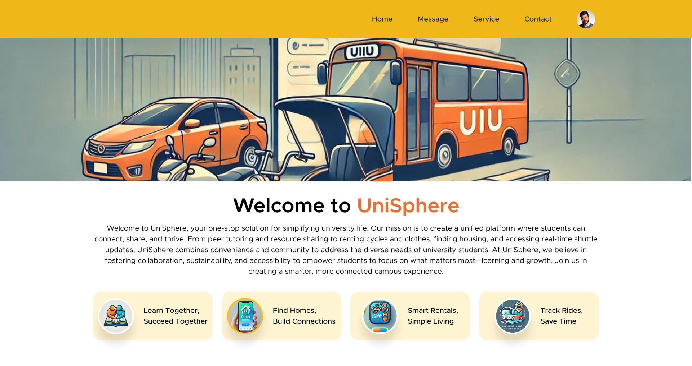
Central hub for accessing all services with quick navigation and user profile

### 🔐 Login & Authentication
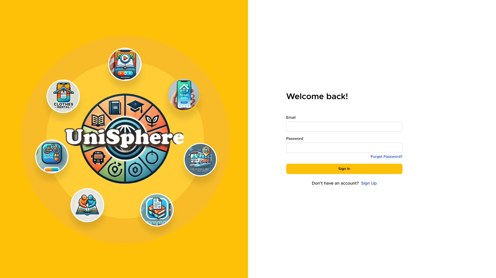
Secure login interface with forgot password functionality
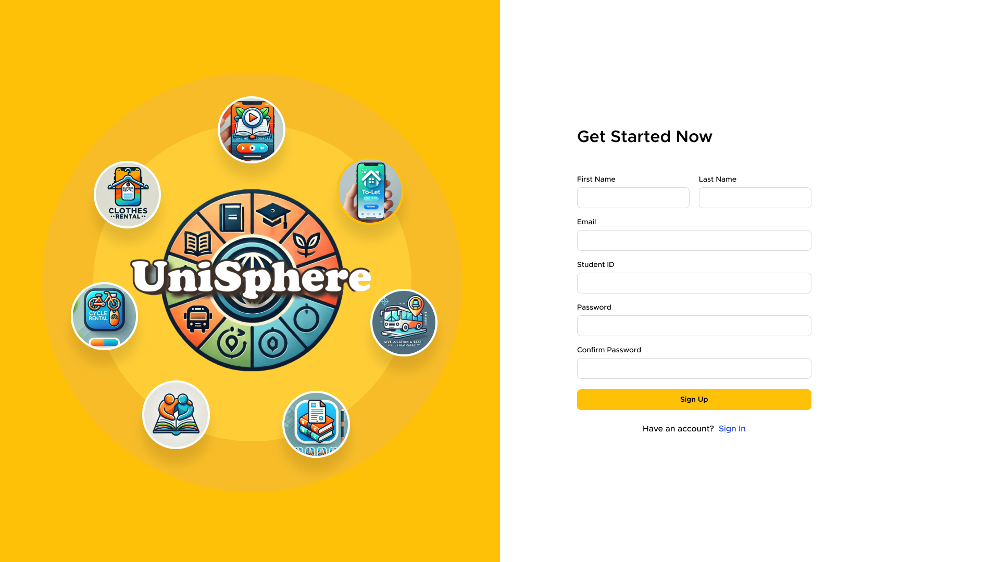
Easy registration process with email verification

### 💬 Chat System
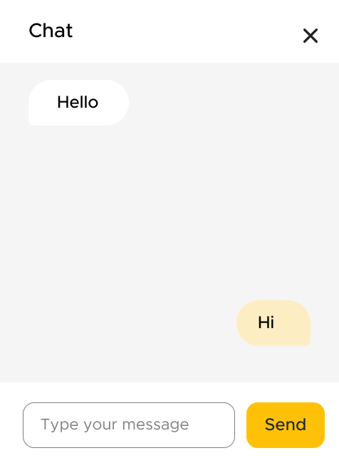
Real-time messaging interface with user list
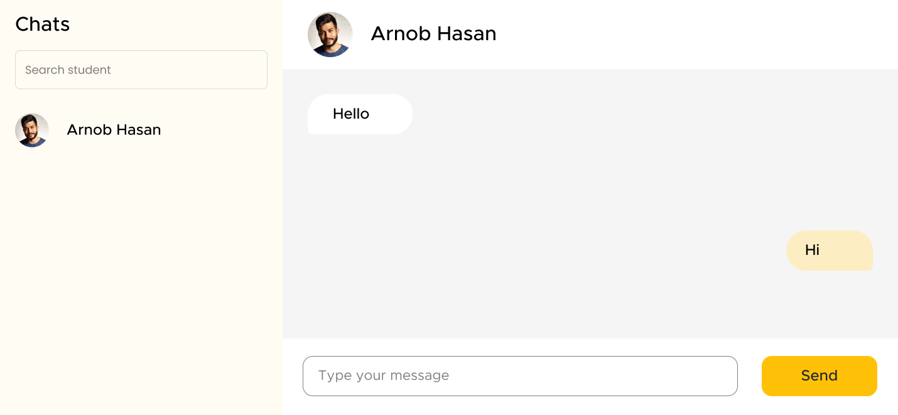
Detailed chat view with message history

### 📚 Academic Resources
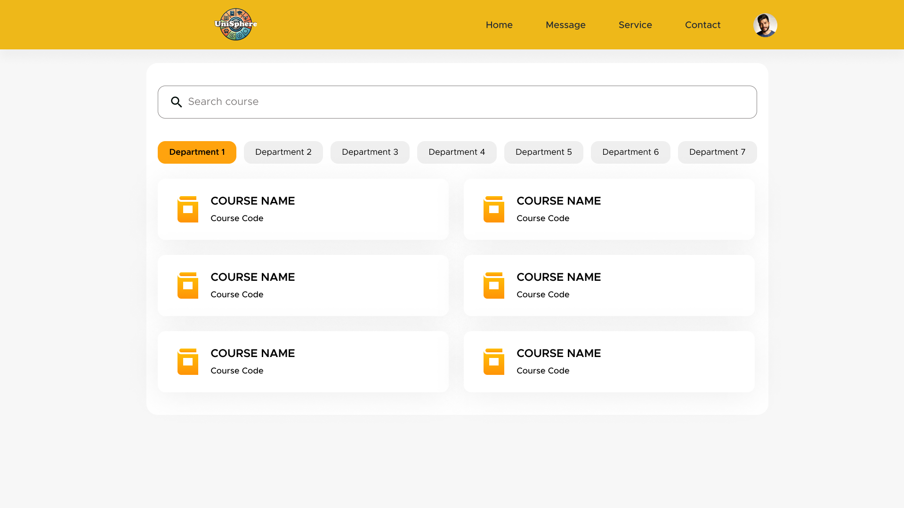
Department-wise course organization
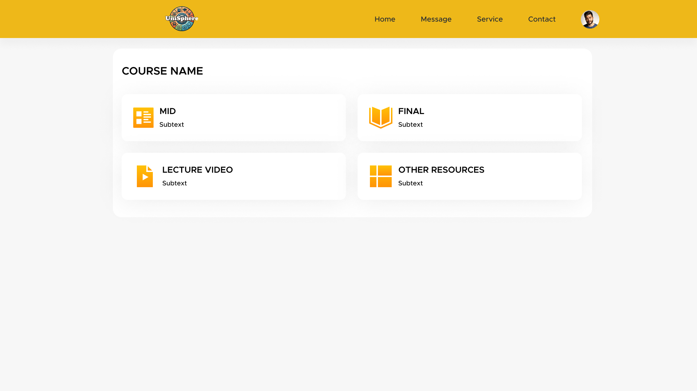
Access to course materials and resources

### 🏠 Campus Services
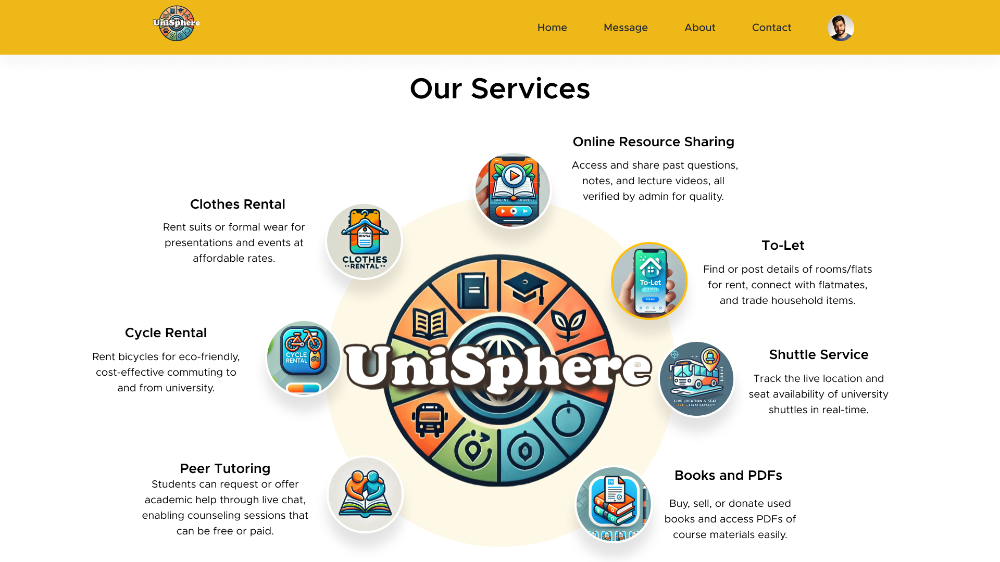
All campus services in one place
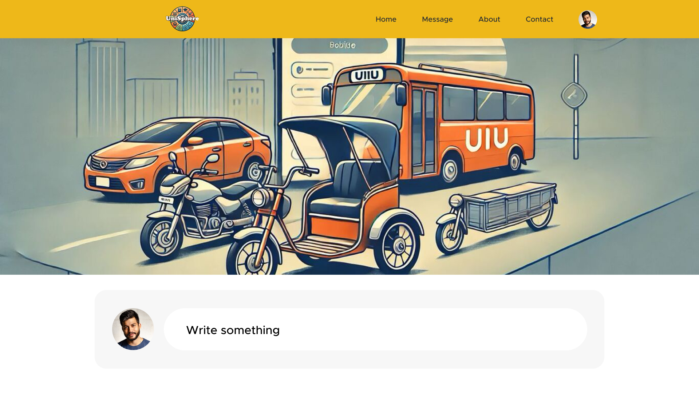
Accommodation rental platform

Formal attire rental service
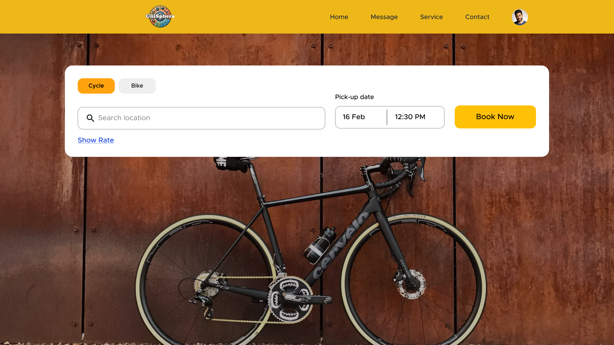
Bicycle rental system

### 👥 Peer Tutoring
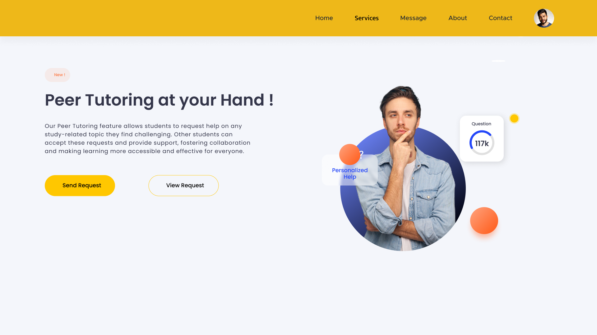
Connect with qualified tutors

Manage tutoring requests and responses

## 🛠️ Technology Stack

### Frontend
- **JavaFX 19.0.2**: Modern UI framework for rich desktop applications
- **FXML**: Declarative UI markup language
- **CSS**: Custom styling for modern interface

### Backend
- **Java 19**: Core programming language
- **MySQL**: Relational database for data persistence
- **JDBC**: Database connectivity

### Build & Dependency Management
- **Maven**: Project build and dependency management
- **JUnit 5**: Unit testing framework

## 📋 Prerequisites

- **Java Development Kit (JDK) 19** or higher
- **Maven 3.6+** for building the project
- **MySQL 8.0+** for database
- **MySQL JDBC Driver** (automatically managed by Maven)

## 🚀 Installation & Setup

### 1. Clone the Repository
```bash
git clone https://github.com/your-username/uniShpere.git
cd uniShpere
```

### 2. Database Setup
Create a MySQL database and run the SQL scripts:

```sql
CREATE DATABASE unishpere;
USE unishpere;

-- Create users table (add your schema here)
-- Create chat_history table
CREATE TABLE IF NOT EXISTS chat_history (
    id INT AUTO_INCREMENT PRIMARY KEY,
    sender_email VARCHAR(255),
    receiver_email VARCHAR(255),
    message_text TEXT,
    timestamp TIMESTAMP DEFAULT CURRENT_TIMESTAMP,
    FOREIGN KEY (sender_email) REFERENCES users(email),
    FOREIGN KEY (receiver_email) REFERENCES users(email)
);
```

### 3. Configure Database Connection
Update the database credentials in `src/main/java/org/example/unishpere/dbConnect.java`:

```java
String dbname="unishpere";
String username="your_mysql_username";
String password="your_mysql_password";
```

### 4. Build the Project
```bash
mvn clean compile
```

### 5. Run the Application
```bash
mvn javafx:run
```

## 📁 Project Structure

```
uniShpere/
├── src/
│   ├── main/
│   │   ├── java/
│   │   │   └── org/example/unishpere/
│   │   │       ├── controllers/     # FXML controllers
│   │   │       ├── models/         # Data models
│   │   │       ├── utils/          # Utility classes
│   │   │       └── HelloApplication.java # Main application class
│   │   └── resources/
│   │       ├── fxml/               # UI layout files
│   │       ├── css/                # Stylesheets
│   │       ├── img/                # Images and assets
│   │       └── sql/                # Database scripts
├── pom.xml                         # Maven configuration
└── README.md                       # This file
```

## 🎯 Key Components

### Controllers
- **HelloApplication**: Main application entry point
- **homeController**: Dashboard and navigation logic
- **servicesController**: Service management and routing
- **ChatServer**: Real-time chat server implementation
- **dbConnect**: Database connection management

### Data Models
- **User**: User profile and authentication
- **Post**: Social media posts and updates
- **TutoringRequest**: Peer tutoring requests
- **Session**: User session management

## 🔧 Configuration

### Application Settings
- **Window Size**: 1920x1080 (Full HD)
- **Chat Server Port**: 5000
- **Database**: MySQL (configurable)

### Customization
- Modify `src/main/resources/css/` for UI styling
- Update `src/main/resources/img/` for custom images
- Configure database schema in `src/main/resources/sql/`

## 🧪 Testing

Run the test suite:
```bash
mvn test
```

## 📦 Building for Distribution

Create an executable JAR:
```bash
mvn clean package
```

The executable JAR will be located in `target/uniShpere-1.0-SNAPSHOT.jar`

## 🤝 Contributing

1. Fork the repository
2. Create a feature branch (`git checkout -b feature/AmazingFeature`)
3. Commit your changes (`git commit -m 'Add some AmazingFeature'`)
4. Push to the branch (`git push origin feature/AmazingFeature`)
5. Open a Pull Request

## 📝 Development Guidelines

- Follow Java coding conventions
- Use meaningful variable and method names
- Add comments for complex logic
- Write unit tests for new features
- Update documentation for API changes

## 🐛 Troubleshooting

### Common Issues

**Port 5000 already in use:**
- Check if another instance is running
- Kill the process using the port
- Change the port in `ChatServer.java`

**Database connection errors:**
- Verify MySQL service is running
- Check database credentials
- Ensure database schema exists

**JavaFX runtime issues:**
- Ensure JavaFX modules are properly configured
- Check Java version compatibility
- Verify Maven dependencies

## 📄 License

This project is licensed under the MIT License - see the [LICENSE](LICENSE) file for details.

## 👥 Authors

- **[Your Name]** - *Initial development* - [YourGitHubProfile]

## 🙏 Acknowledgments

- JavaFX community for excellent documentation
- MySQL for reliable database solution
- Maven for simplified build management
- All contributors and users of UniShpere

## 📞 Support

For support, please open an issue on GitHub or contact:
- Email: support@unishpere.com
- GitHub Issues: [Create New Issue](https://github.com/your-username/uniShpere/issues)

---

**UniShpere** - Making campus life simpler, one service at a time! 🎓✨
